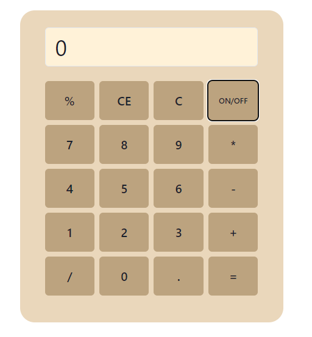
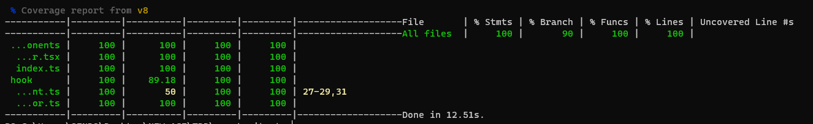

# Calculator React with TypeScript and Chakra UI

This is a sample project that demonstrates how to create a responsive calculator using React with TypeScript and the Chakra UI component library. In addition, unit tests have been implemented using Vite to ensure 100% test coverage.

## Features

- Functional calculator with basic operations.
- Responsive user interface to adapt to different screen sizes.
- Unit tests with Vite and Jest to ensure 100% test coverage.
- Written in TypeScript to enhance code security and maintainability.

## Screenshots





## Installation

Follow these steps to run the project on your machine:

1. Clone this repository:

   ```bash
   git clone https://github.com/tuusuario/calculadora-react.git
   cd calculadora-react
   yarn install
   yarn dev
   ```

la aplicacion está disponible en <http://localhost:5173/>

## Pruebas Unitarias

To run unit tests and check for 100% coverage, use the following commands:

```bash
   yarn run test
   yarn run coverage
   ```

Author
Luis Hernando Sendoya Serrato
